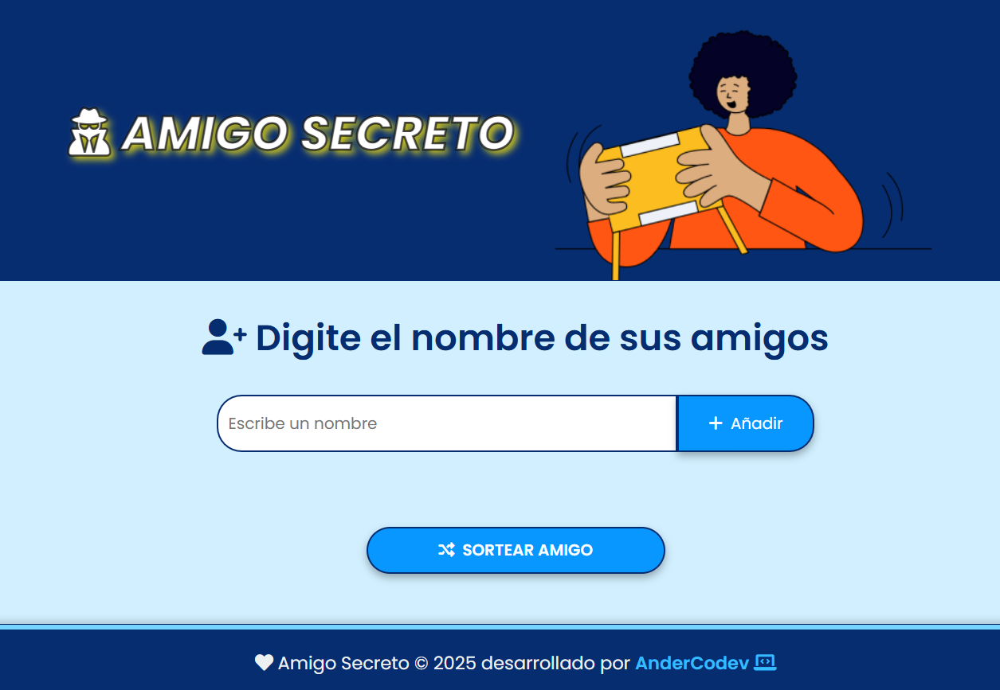

# Amigo Secreto 🎁


¡Bienvenido a **Amigo Secreto**! Este proyecto te ayuda a organizar y sortear amigos secretos de forma sencilla y divertida. Con una interfaz intuitiva, puedes agregar amigos, visualizar la lista en tiempo real y realizar un sorteo para elegir al ganador. 🎉

---

## 🚀 Funcionalidades

- **Añadir amigos**: Agrega nombres de participantes al sorteo de manera dinámica.
- **Lista interactiva**: Muestra una lista actualizada en tiempo real de los amigos añadidos.
- **Sorteo automatizado**: Selecciona un ganador al azar de la lista.
- **Diseño moderno y adaptable**: Estilo responsivo y amigable para usuarios.

---

## 🛠️ Tecnologías utilizadas

- **HTML5**: Para la estructura principal del proyecto.
- **CSS3**: Para los estilos visuales modernos y atractivos.
- **JavaScript**: Para la lógica interactiva del sorteo y manipulación de la lista.
- **Font Awesome**: Para los íconos interactivos en la interfaz.
- **Poppins**: Fuente utilizada para una apariencia limpia y profesional.

---
## 👨‍💻 Cómo usar el proyecto
Clona el repositorio: 
- git clone https://github.com/tu-usuario/amigo-secreto.git
Abre el proyecto:
- Abre el archivo **index.html** en tu navegador web.
Interactúa:
- 1.- Agrega nombres de amigos al campo de texto y haz clic en el botón - "Añadir".
- 2.- Visualiza la lista de amigos que has agregado.
- 3.- Realiza un sorteo al azar para elegir un ganador.
---

## 📂 Estructura del proyecto

```plaintext
📦 amigo-secreto
├── 📂 assets
│   ├── 📂 icons        # Íconos SVG usados en lugar del CDN
│   ├── 📂 img          # Imágenes incluidas en el proyecto
├── 📂 styles
│   ├── style.css       # Archivo principal de estilos
├── index.html          # Página principal del proyecto
├── app.js              # Archivo con la lógica del proyecto
├── README.md           # Documentación del proyecto
```


🎨 Captura de pantalla


## 🌟 Créditos
- Amigo Secreto fue desarrollado por **AnderCodev** Inspirado en la idea de crear sorteos de manera divertida y fácil.

## 💻 link de enlace 
sistema desplegado:
- https://amigo-secreto-foan812od-andercodevs-projects.vercel.app/